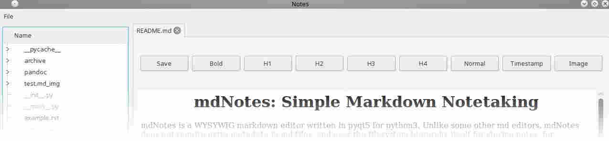

mdNotes: Simple Markdown Notetaking
===================================

mdNotes is a WYSYWIG markdown editor written in pyqt5 for python3. Unlike some other md editors, mdNotes does not require extra metadata in md files, and uses the filesystem hierarchy itself for storing notes, for maximum compatibility with other tools, especially android phones when using folder sync systems.

mdNotes is not even currently alpha quality yet.

mdNotes internally uses pandoc to load and save markdown and so can be modified easily to support almost any format. However, one should back up any notes before opening them with mdnotes, as it may wreck any fancy formating in the load/save process.

Because mdNotes is designed for note-taking and not programming, it will automatically save all open notes when you close the program or close a tab.

mdNotes also supports plain .txt, with limited support for reStructuredText files and HTML.

Any HTML page can be opened in read-only mode with full webkit features. Also, any file can be edited as a raw text file.

Although mdNotes is primarily hierarchal, links to local files are fully supported. mdNotes uses webkit for rendering, so you can freely drag and drop images into pages(images from websites will automatically be downloaded into a local folder in the same directory as the note.)

You can also drag and drop links directly from the file browser sidebar into a note. 

Links dropped in this manner will automatically be converted into relative paths relative to the document you are dropping them into(So they will keep working if you move or copy the whole notebook folder) and will be converted into the proper title for the note using a heuristic("note title" becomes Note Title, "the title of the note" becomes "The Title of the Note")

Links dropped in from outside the notebook will not be modified.

Installation
------------

mdNotes depends on python3, pyqt5, pyqt5 webkit, and send2trash. mdNotes also depends on pyandoc which is included, but needs to have pandoc installed to work.

On Ubuntu:

    sudo apt-get install python3-pyqt5 python3-pyqt5.qtwebkit
    sudo pip3 install send2trash

then simply run `__main__.py`

You can then use File&gt;Open Notebook Folder to open the folder you want to keep your notes in(It defaults to the working directory), and use File&gt;Set as Default Notebook to make this the notebook used every time the application starts.

Config Files
------------

mdNotes will look for "~/.mdnotes/mdnotes.conf" and then for notebookfolder/notebook.conf (values in the second one take precedence over the first one)

The "~/.mdnotes" folder is also where the default notebook is kept, in a text file called notebooks.txt which is just the URL of a notebook.

The format is a normal INI style file, with the following format:

    [basic]
    #Use this to specify an alternate time formatting for the timestamp button
    strftime =  %b %d %I:%M%p %G

WARNING
-------

Don't use this in folders containing important notes. This is pre-alpha software. That being said, this readme file is maintained using mdNotes itself.

Theming and customization
-------------------------

Because mdNotes renders with webkit, you can put a style.css folder in your notes folder that will be applied to the text. You have to restart mdNotes for a new theme to work.

You can also put a global theme in ~/.mdnotes/style.css, however themes directly in the notebook will take precedence.

Formatting Examples
-------------------

> This is a block quote, which you can create by clicking a button
> -the author of this program

This is a paragraph of normal text.

*This is italic*

**Bold**

1.  Ordered list item 1
2.  item 2

-   Unordered lists
-   Item 2
-   item 3

todo: This todo list item will show up in your todo list, which you can find at Tools&gt;Todo List

done: This todo list item will show up in your todo list crossed out

Todo list items can be anywhere in your notebook and are sorted by what file they are in.

    This is a block of preformatted text
    Note that it is in monospace and looks different.
    Perfect for writing code samples

### Headings

Can also be made just by clicking the button.
because mdNotes uses github flavored markdown, sharing your notes is easy.
